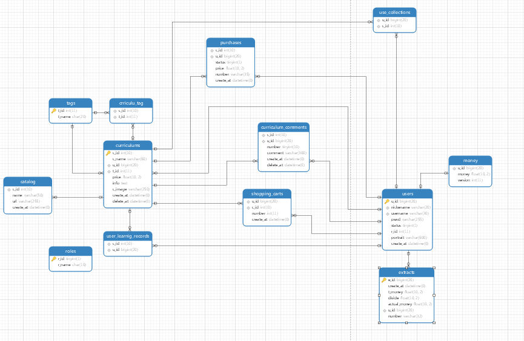
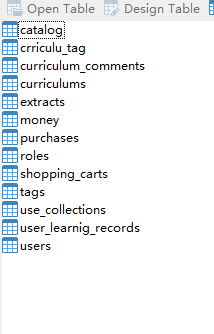

# 使用库
```
gin,redis,mysql,gorm
aliyun-oss          github.com/aliyun/aliyun-oss-go-sdk/oss
alipay              github.com/smartwalle/alipay/v3
```


# 仿照需求
```url
http://www.rrkf.com/serv/requestDetail?id=dbb8ac98-e955-4026-8037-b76a7cfffcdf
https://study.163.com/course/introduction.htm?courseId=1209318815&_trace_c_p_k2_=603ae532ed344e59856e4bdbb8dced2a
```


# 修改
1.用户表只添加学生用户和老师用户,管理员表另外添加

2.添加老师所属机构?

3.删除课程表中t_id字段,使用第三方表存储课程所有tag
```mysql
alter table curriculums drop column t_id
```

4.在课程收藏表添加添加时间字段和删除字段
```mysql
alter table use_collections add create_at datetime default now();
alter table use_collections add delete_at datetime;
```

5.修改添加(评论表..)联合索引,默认设置错误,每个课程的每个用户只能评论一个,除非删除
```mysql
alter table curriculum_comments drop foreign key curriculum_comments_ibfk_1;
alter table curriculum_comments drop foreign key curriculum_comments_ibfk_2;
alter table curriculum_comments drop index c_id;
alter table curriculum_comments drop index u_id;
alter table curriculum_comments add unique index (u_id,c_id);
alter table curriculum_comments add foreign key curriculum_comments_ibfk_1 (u_id) references users(u_id);
alter table curriculum_comments add foreign key curriculum_comments_ibfk_2 (c_id) references curriculums(c_id);

#课程目录修改
alter table catalog add delete_at datetime;
alter table catalog add id int primary key auto_increment;
```

6.后台管理增加模型字段(增加字段为显示软删除执行人员和执行人员软删除时间)
```mysql
alter table  curriculum_comments add admin_del datetime;
alter table  curriculum_comments add a_id tinyint;
alter table curriculum_comments add foreign key delete_admin_user_id (a_id) references admins(a_id);

alter table  users add admin_del datetime;
alter table  users add a_id tinyint;
alter table  users add foreign key delete_admin_user_id (a_id) references admins(a_id);

alter table  curriculums add admin_del datetime;
alter table  curriculums add a_id tinyint;
alter table  curriculums add foreign key delete_admin_user_id (a_id) references admins(a_id);
```


#mysql语句
```mysql  建数据库
create database test;

use test;

Create table roles(
`r_id` tinyint(1) primary key comment '角色id',
`r_name` char(10) comment '角色名字'
)ENGINE=InnoDB DEFAULT CHARSET=utf8;

Create table users (
`u_id` bigint primary key auto_increment comment '用户id',
`nickename` varchar(20) unique comment '用户昵称',
`username` varchar(30) not null unique comment '用户账号',
`pswd` varchar(255) comment '密码',
`status` tinyint(1) default '0' comment '外键 用户注册状态,默认为0 未激活',
`r_id` int default '2' comment '身份默认为2,0管理员,1老师 2xuesheng',
`portrait` varchar(250) comment '用户头像 随意设置默认把,如果有统一请设置为这个',
`create_at` datetime default now(),
foreign key (r_id) references roles(r_id)   // 有问题外键加不上
)ENGINE=InnoDB AUTO_INCREMENT=100000 DEFAULT CHARSET=utf8;

admin
create table admins (
`aid` tinyint primary key auto_increment comment '管理员id',
`username` char(20) not null comment '账号',
`pswd` varchar(255) not null comment '密码',
`status` tinyint default '0' comment '身份信息',
`info` text comment '一些额外的信息',
`create_at` datetime default current_timestamp,
UNIQUE KEY `username` (`username`))
ENGINE=InnoDB AUTO_INCREMENT=10000 DEFAULT CHARSET=utf8;

Create table money (
`u_id` bigint unique comment '外键用户表id,唯一',
`money` float(10,2) default '0.00' comment '金钱',
`version` int comment '乐观锁,版本控制',
Foreign key (u_id) references users(u_id)	
)ENGINE=InnoDB DEFAULT CHARSET=utf8;


Create table extracts (
`e_id` bigint primary key auto_increment comment '主键自增长',
`create_at` datetime default now() comment '创建时间',
`t_money` float(10,2) comment '提取金额',
`divide` float(10,2) comment '站点分成,默认为5%',
`actual_money` float(10,2) comment '实际提成',
`u_id` bigint comment '外键 用户id',
`number` varchar(32) comment '流水号',
Foreign key (u_id) references users(u_id)
)ENGINE=InnoDB  AUTO_INCREMENT=100000 DEFAULT CHARSET=utf8;


Create table tags (
`t_id` int primary key auto_increment,
`t_name` char(20)
)ENGINE=InnoDB DEFAULT CHARSET=utf8;


Create table curriculums (
`c_id` int(10) primary key auto_increment comment '课程id',
`c_name` varchar(60) not null comment '课程名字',
`u_id` bigint comment '外键 课程老师id',
`t_id` int comment '外键 tagid',
`price` float(10,2) default '0' comment '价格',
`info` text comment '课程介绍',
`c_image` varchar(250) comment '阿里云oos直传',
`create_at` datetime default now() comment '创建时间',
`delete_at` datetime comment '删除时间',
Foreign key (u_id) references users(u_id),
Foreign key (t_id) references tags(t_id)
)ENGINE=InnoDB  AUTO_INCREMENT=100 DEFAULT CHARSET=utf8;


Create table crriculu_tag (
`c_id` int(10) comment '外键 课程id 第三方表',
`t_id` int comment '外键 标签tagsid 第三方表',
Foreign key (c_id) references curriculums (c_id),
Foreign key (t_id) references tags(t_id)
)ENGINE=InnoDB DEFAULT CHARSET=utf8;


Create table Catalog (
`c_id` int(10) comment '外键 课程id',
`name` varchar(50) comment '课程目录',
`url` varchar(255) comment '目录地址',
`create_at` datetime default now() comment '一个课程多个目录,根据时间排序',
Foreign key (c_id) references curriculums (c_id)
)ENGINE=InnoDB DEFAULT CHARSET=utf8;


Create table curriculum_comments(
`c_id` int(10) comment '外键 课程id',
`u_id` bigint comment '外键 用户id',
`number` tinyint(10) comment '评价分数',
`comment` varchar(300) comment '评价',
`create_at` datetime default now() comment '创建时间',
`delete_at` datetime comment '删除时间',
Foreign key (c_id) references curriculums (c_id),
Foreign key (u_id) references users(u_id)
)ENGINE=InnoDB DEFAULT CHARSET=utf8;


Create table use_collections (
`u_id` bigint comment '外键 用户id',
`c_id` int(10) comment '外键 课程id',
Foreign key (c_id) references curriculums (c_id),
Foreign key (u_id) references users(u_id)
)ENGINE=InnoDB DEFAULT CHARSET=utf8;


Create table user_learnig_records (
`c_id` int(10) comment '外键 课程id',
`u_id` bigint comment '外键 用户id  未完成功能记录每个课程每个用户在那个学习目录',
Foreign key (c_id) references curriculums (c_id),
Foreign key (u_id) references users(u_id)
)ENGINE=InnoDB DEFAULT CHARSET=utf8;


Create table purchases (
`c_id` int(10) comment '外键 课程id',
`u_id` bigint comment '外键 用户id',
`status` tinyint(1) comment '订单状态,默认为0未支付 支付为1',
`price` float(10,2) comment '订单当时价格,数量不考虑因为是类似网易云课堂这种 只能买一份',
`number` varchar(35) comment 'uuid流水号',
`create_at` datetime default now() comment '创建时间',
Foreign key (u_id) references users(u_id),
Foreign key (c_id) references  curriculums (c_id)
)ENGINE=InnoDB DEFAULT CHARSET=utf8;


Create table shopping_carts (
`u_id` bigint comment '外键 用户id',
`c_id` int(10) comment '外键 课程id',
`number` int default '1' comment '课程数量,但是是网易云课堂类似的,默认就是1买把...',
`create_at` datetime default now() on update now() comment '创建时间',
Foreign key (u_id) references users(u_id),
Foreign key (c_id) references curriculums(c_id)
)ENGINE=InnoDB DEFAULT CHARSET=utf8;
```

# table展示




# 编译
windows 下编译                  go bulid main.go 
windows 下编译为liunx环境应用     .\liunxCompile.bat
liunx   下编译                  go bulid main.go 


# 运行
```shell script
根据情况,修改一些配置,不要参照
```
build.sh 编译下载docker并运行容器
